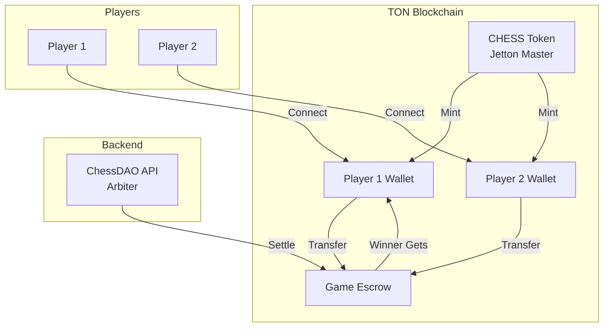

# TON Smart Contract Architecture

## Overview

ChessDAO uses two smart contracts on TON:



## Contract 1: CHESS Token (Jetton)

**Purpose:** Fungible token for betting and rewards

**Standard:** TEP-74 (Jetton Standard)

### Key Operations

| Operation | Who | Description |
|-----------|-----|-------------|
| `mint` | Admin | Create new tokens |
| `transfer` | Owner | Send tokens to another user |
| `burn` | Owner | Destroy tokens |

### Storage Layout

```
total_supply:    uint128  - Total minted tokens
admin_address:   Address  - Can mint/change admin
content:         Cell     - Metadata (name, symbol, etc.)
jetton_wallet:   Cell     - User wallet contract code
```

---

## Contract 2: Game Escrow

**Purpose:** Hold bets for a chess game, release to winner

### States

| State | Value | Description |
|-------|-------|-------------|
| WAITING | 0 | Creator deposited, waiting for opponent |
| ACTIVE | 1 | Both deposited, game in progress |
| SETTLED | 2 | Winner received pot |
| CANCELLED | 3 | Game cancelled, refunded |

### Flow

1. **Create Game** → Deploy new escrow, creator deposits
2. **Join Game** → Opponent deposits matching amount
3. **Play Game** → Off-chain via ChessDAO server
4. **Settle** → Backend (arbiter) calls `settle_game(winner)`
5. **Payout** → Winner receives 2x bet

### Security

- Only designated arbiter can settle games
- Creator can cancel if opponent hasn't joined
- All deposits validated against expected amounts

---

## Development Commands

```bash
cd ton

# Install dependencies
npm install

# Build contracts
npx blueprint build

# Run tests
npx blueprint test

# Deploy to testnet
npx blueprint run deployChessToken
```

## Resources

- [TON Docs](https://docs.ton.org/)
- [FunC Language](https://docs.ton.org/develop/func)
- [Jetton Standard](https://github.com/ton-blockchain/TEPs/blob/master/text/0074-jettons-standard.md)
